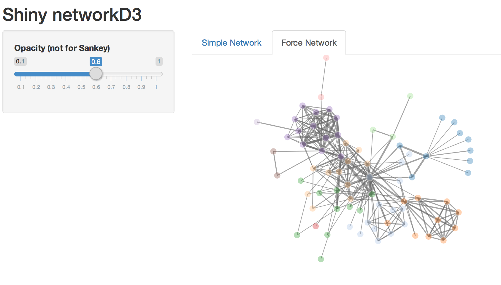

networkD3-shiny-example
=======================

An example of a Shiny web app using networkD3 graphs.

To run the example from R use:

```S
shiny::runGitHub('christophergandrud/networkD3-shiny-example')
```

You should then see something like this:


